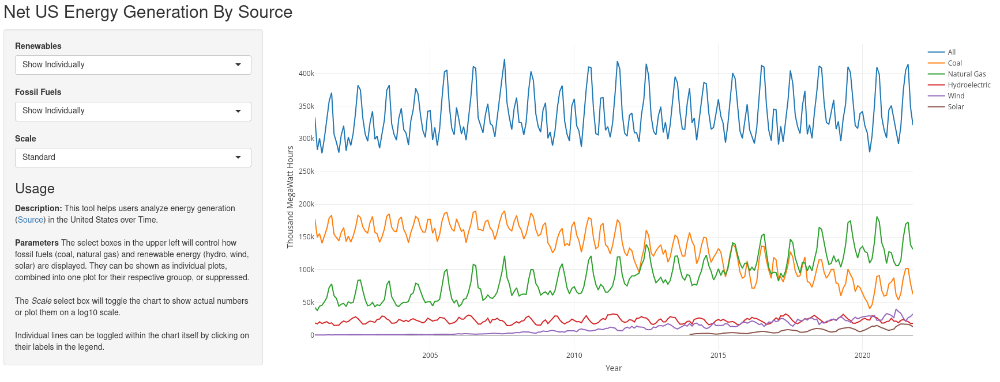
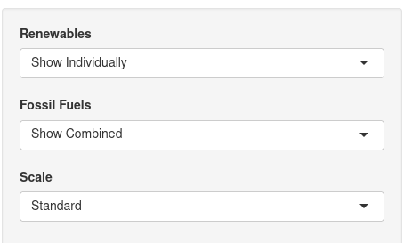
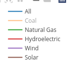

Energy Generation Analysis - It's the future
========================================================
author: Jeff Shelley
date: 01/12/2022
autosize: true

Can't get the answers you need?
========================================================

Have you ever been using the EIA's Electricity Data Browser1, only to be dismayed by its lack of options?

- How has our aggregate fossil fuel usage changed (in electricity generation)?
- How are our renewables doing, in total?

3463402.25361 Thousand MegawattHours generated last year, and all this hassle to answer these questions?  What gives?

1. https://www.eia.gov/electricity/data/browser/

We have the solution
========================================================
With the new USEnergyGeneration1 tool, now you can get answers to your questions!

1. https://datajunkie-eng.shinyapps.io/usenergygeneration/

Totally Customizable
========================================================
Aggregate, suppress and scale your desired electricity source with unprecedented ease!

Show only the specific types of energy source that you *want* to!

Thank you!
========================================================
Please subscribe to our newsletter and buy all our products.  Donations are also appreciated.
